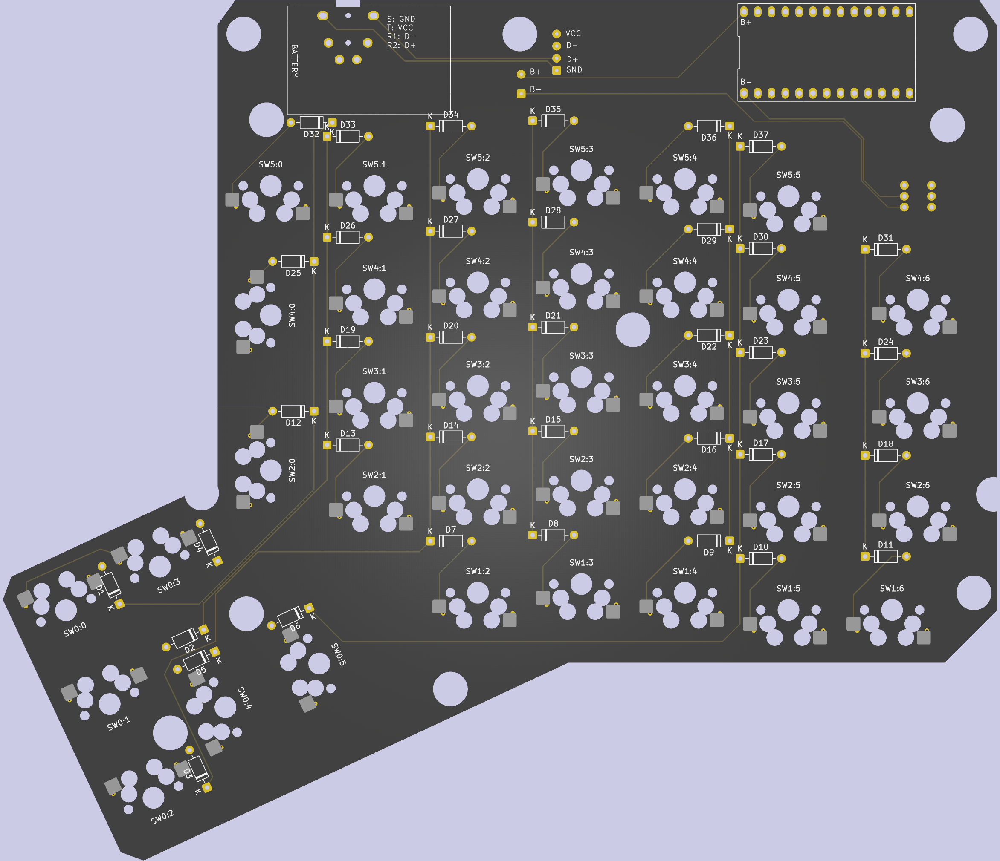

# ErgoDox EZBL

A drop-in board for the ErgoDox EZ keyboard, using a Nice!Nano V2 running [ZMK](https://zmk.dev), giving you Bluetooth connectivity without any modifications to the case.

## Features

- Drop-in replacement for the original ErgoDox EZ PCB, no modifications to the case needed
- Bluetooth wireless via Nice!Nano V2
- [ZMK Studio](https://zmk.studio) support for real-time keymap editing

## PCB

The PCB is reversible, which means you can use the same PCB for both half of the keyboard.



## Material

Here are the components I used to build the keyboard. Except the jack connector and the keyboard itself, everything comes from AliExpress.

### keyboard

- [ErgoDox EZ](https://ergodox-ez.com/) only tested on PCB revision B. If you have a different revision, you might need to adapt the PCB to fit your case.
- [Nice!Nano V2.0 board](https://ja.aliexpress.com/item/1005009890279520.html)
- 2 x [502030 3.7V 250mAh battery](https://ja.aliexpress.com/item/1005008164278041.html)
- Power switch [K060c-High head 6pin](https://ja.aliexpress.com/item/1005009691388897.html)
- [110pcs Kailh Hot-swappable PCB Socket Hot Plug](https://ja.aliexpress.com/item/1005007232040760.html)
- [100PCS 1N4148](https://ja.aliexpress.com/item/1005007807649334.html)
- 2 x [Type C Male Plug 90 Degree Vertical Patch Board 4Pin](https://ja.aliexpress.com/item/1005007518583727.html) ⚠️ make sure you order the "4pin" ones.
- 2 x [Audio Jack TRRS SJ3-35094A](https://www.marutsu.co.jp/pc/i/48269694/) (couldn't find it on AliExpress)

### Cable

You will need an USB-Jack cable to recharge and flash your keyboard. The pinout is as follows:

| Jack   | USB  |
| ------ | ---- |
| Tip    | VBUS |
| Ring1  | D-   |
| Ring2  | D+   |
| Sleeve | GND  |

```
        Tip     R1      R2        Sleeve
        _____  _____  _____  _______________
       /     ||     ||     ||               |
      |      ||     ||     ||               |======= cable
       \_____||_____||_____||_______________|
          |      |      |          |
USB:    VBUS     D-     D+        GND
```

I used these components (make sure you order the 4 pole ones):

- [3.5mm Jack Connector DIY 4 Poles](https://ja.aliexpress.com/item/1005005570281912.html)
- [USB cable](https://ja.aliexpress.com/item/1005005292500613.html)
